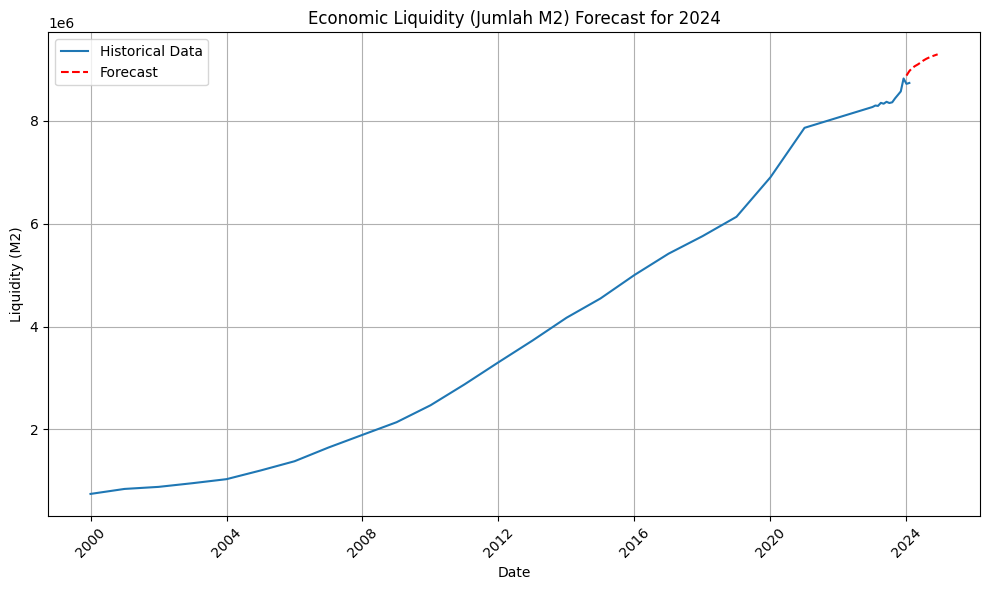
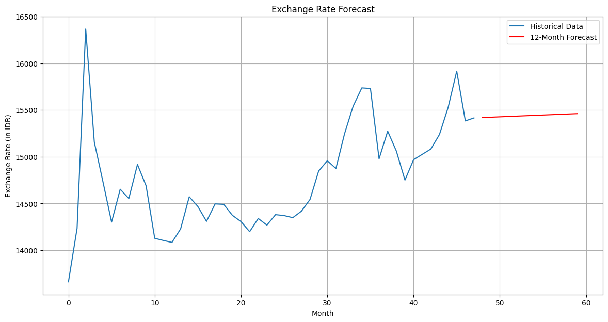
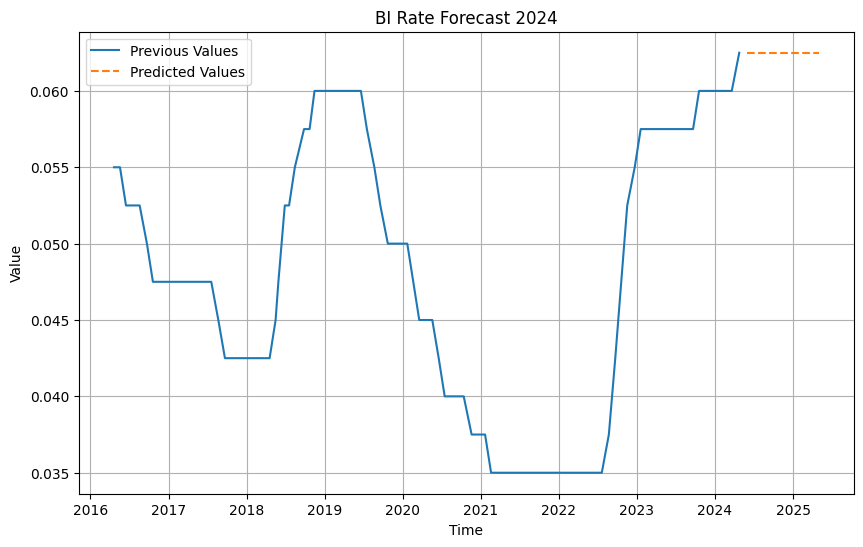
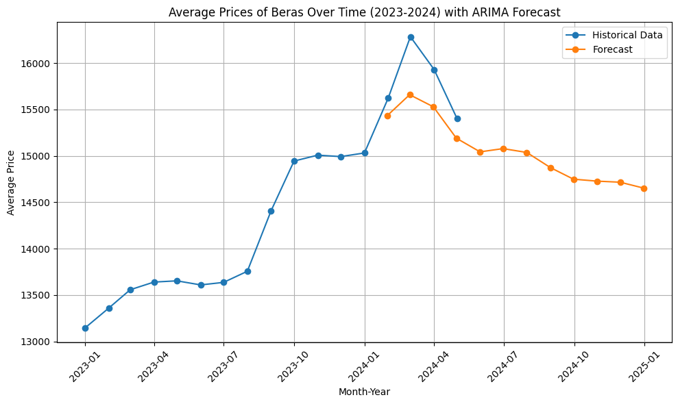
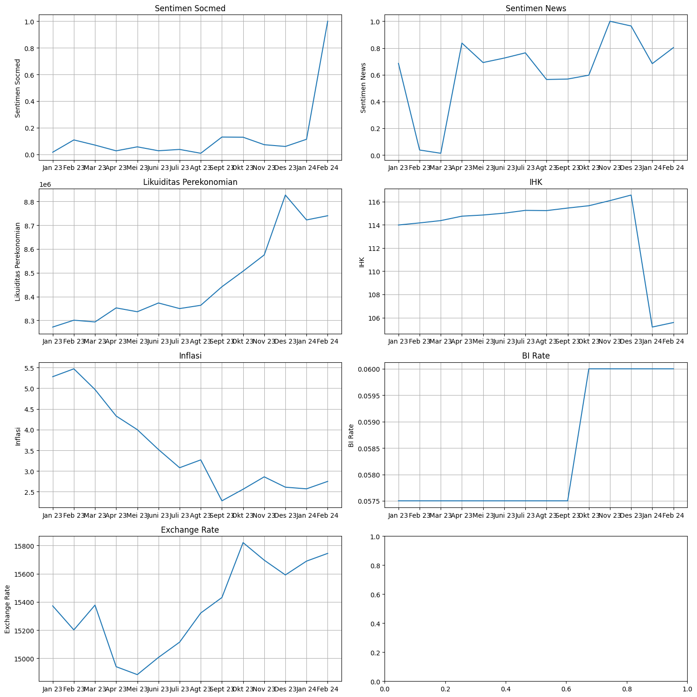
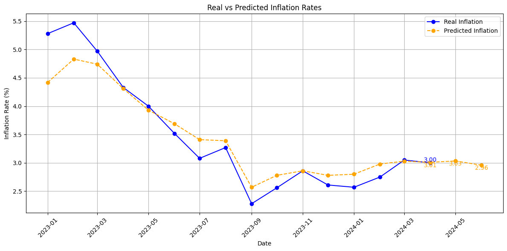
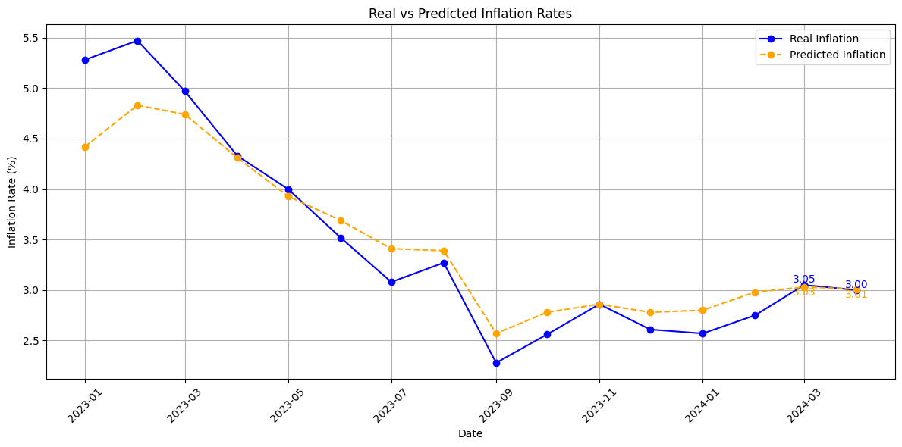
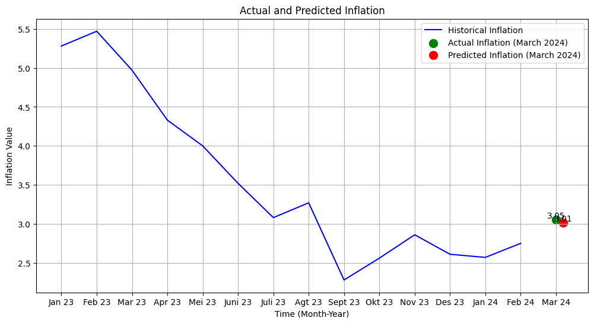

# 🎯 AI-Driven Inflation Prediction System with Interactive Simulation

**Status**: ✅ **COMPLETE & OPERATIONAL**
**Version**: 3.0 (Production Release)

---

## 🚀 QUICK START (Open Dashboard in 10 seconds)

### Option 1: Direct File (Easiest)
```bash
# Copy this path to your browser:
file://./index.html
```

### Option 2: Python Server
```bash
cd ./
python -m http.server 8000
# Then visit: http://localhost:8000/index.html
```

---

## 📊 What You'll See

### Dashboard Components:
1. **Prediction Metrics** - Inflation forecast with accuracy indicators
2. **Historical Chart** - Historical trend + forecast horizon
3. **Feature Importance** - Which factors drive the prediction most
4. **Interactive Simulator** - Sliders to test "what-if" scenarios in real-time
5. **Government Analysis** - LLM-generated policy recommendations

### Color Coding:
- 🟢 **Green** (< 2.5%): Low inflation ✓
- 🟡 **Yellow** (2.5-4%): Moderate inflation ✓ (within BI target)
- 🔴 **Red** (> 4%): High inflation ⚠️

---

## 🧮 Forecasting Methodology

Before reaching the dashboard, every macroeconomic variable is forecasted individually using classical time-series approaches. These per-variable forecasts form the foundation of the feature set that is later combined and surfaced in the dashboard.

### Variables Forecasted

| Variable | Data Source | Model |
|---|---|---|
| **Liquidity (M2 / Money Supply)** | `data_liquidity.jsonl` | ARIMA (direct & iterative forecast) |
| **Exchange Rate (USD/IDR)** | Historical monthly data | ARIMA, cross-validated with VAR (Exchange Rate ↔ CPI) |
| **CPI per Commodity** (Shallot, Rice, Chili, etc.) | `ihk_results.jsonl` | ARIMA per category |
| **BI Rate / BI-7Day Reverse Repo Rate** | PostgreSQL database (`data_bi`) | ARIMA with linear trend, evaluated via train-test split |
| **News & Social Media Sentiment** | Monthly sentiment data (negative/positive/total) | Normalized into an index, paired with CPI via VAR |


*Liquidity trend (M2 / Money Supply) from historical data*


*USD/IDR exchange rate forecast using ARIMA*


*BI Rate / BI-7Day Reverse Repo Rate forecast*


*CPI forecast per food commodity category*


*Summary of all supporting variables used as inflation prediction features*

### Time-Series Modeling Approach
- **ARIMA (univariate)** — used for M2, exchange rate, BI rate, and CPI per commodity, with the `(p,d,q)` order tuned per variable.
- **3 forecasting strategies compared**:
  - *Direct forecast* — model fitted once, forecasting 12 months ahead directly.
  - *Iterative/recursive forecast* — each month, the previous prediction is fed back in as new data and the model is re-fitted (rolling re-fit) to forecast the next month.
  - *Train-test split* — performance evaluated before forecasting forward, using MAE/MSE/RMSE.
- **VAR (multivariate)** — captures relationships between variables simultaneously, e.g. exchange rate ↔ CPI, and normalized sentiment ↔ CPI per commodity. Optimal lag selected automatically via AIC.

### Predicted vs Actual Inflation







### Model Evaluation

| Metric | Value |
|---|---|
| **MAE** (Mean Absolute Error) | 0.22562 |
| **MSE** (Mean Squared Error) | 0.10171 |
| **RMSE** (Root Mean Squared Error) | 0.31891 |

An RMSE of ±0.32 means the average deviation between predicted and actual inflation sits around 0.3 percentage points — fairly tight for a monthly macroeconomic indicator.

> Note: the output of each per-variable model above becomes an *input feature* that is later combined in the pipeline (`model_training.py`) to produce a single final inflation prediction, which is what's shown on the dashboard.

---

## 🎮 Interactive Simulator - Try These Scenarios:

### Scenario 1: BI Rate Hike
```
Action: Drag "BI Policy Rate" slider from 6% → 8%
Result: Inflation prediction drops (rates cool demand)
```

### Scenario 2: Currency Crisis
```
Action: Drag "USD/IDR Exchange" slider from 15,500 → 17,000
Result: Inflation prediction rises (import costs pass through)
```

### Scenario 3: Sentiment Recovery
```
Action: Drag both sentiment sliders (news & social media) to +0.7
Result: Inflation prediction drops (confidence effect)
```

**Note**: All calculations happen instantly in your browser—no server needed!

---

## 📁 Project Structure

```
inflation-prediction/
│
├── 🌟 index.html (MAIN OUTPUT - Open this in browser!)
│
├── 🖼️ image/ (forecast charts per variable)
│   ├── all-variable.png
│   ├── birate.png
│   ├── exchangerate.png
│   ├── ihkforecast.png
│   ├── inflation-1.png
│   ├── inflation-2.png
│   ├── inflation-3.png
│   └── liquidity-data.png
│
├── 📚 DOCUMENTATION
│   ├── README.md (this file)
│   ├── QUICK_START.md (60-second guide)
│   ├── SYSTEM_DOCUMENTATION.md (complete reference)
│   ├── TECHNICAL_ARCHITECTURE.md (engineering details)
│   ├── EXECUTION_SUMMARY.txt (results summary)
│   └── project_brief.md (original V3 requirements)
│
├── 🐍 PYTHON MODULES (5 Phases)
│   ├── data_ingestion.py (Phase 1: Data collection)
│   ├── llm_sentiment_pipeline.py (Phase 2: NLP analysis - news & social media)
│   ├── model_training.py (Phase 3: ML model)
│   ├── llm_government_insights.py (Phase 4: Policy reports)
│   ├── html_factory.py (Phase 5: Dashboard generation)
│   └── main_orchestrator.py (Master orchestrator)
│
├── 📊 OUTPUT DIRECTORY: inflation_prediction_output/
│   ├── index.html (standalone dashboard)
│   ├── unified_dataset.csv (raw 36-month features)
│   ├── enriched_dataset.csv (with sentiment scores)
│   ├── model_export.json (model coefficients)
│   ├── government_report.json (structured analysis)
│   ├── government_report.txt (human-readable report)
│   ├── execution_log.json (pipeline trace)
│   ├── news_batches.csv (news text by month)
│   └── social_media_batches.csv (social media text)
│
└── 🔧 CONFIGURATION
    └── .venv/ (Python virtual environment)
```

---

## 🏗️ System Architecture (5 Phases)

### **Phase 0: Per-Variable Time-Series Forecasting**
- Forecasts each macroeconomic variable individually (M2, exchange rate, BI rate, CPI, sentiment) using ARIMA & VAR.
- The output of this phase becomes the *historical + forecasted features* used in Phase 1.

### **Phase 1: Data Ingestion Engine**
- Scrapes Bank Indonesia inflation data
- Integrates Yahoo Finance for USD/IDR rates
- Aggregates news & social media text by month

### **Phase 2: LLM-Driven Sentiment Analysis**
- Batches monthly text data from **news** and **social media** separately
- Routes through LLM (OpenAI/Anthropic/HuggingFace/Mock)
- Outputs continuous sentiment scores [-1.0, +1.0] for each source
- **No hardcoded rules—100% LLM analysis**

### **Phase 3: Model Training**
- Combines all features (per-variable forecasts + news sentiment + social media sentiment) to predict next month's inflation
- **TimeSeriesSplit validation** (prevents data leakage)
- Evaluation: MAE 0.22562, MSE 0.10171, RMSE 0.31891
- Exports linear approximation for JavaScript

### **Phase 4: Government Insights Generator**
- LLM generates government impact analysis
- Produces 3-timeline policy recommendations
- **No templates—full analytical reasoning**
- Outputs structured government report

### **Phase 5: Standalone HTML Dashboard**
- Single file, fully self-contained
- Embedded data + Tailwind CSS + Chart.js
- **Interactive slider simulator engine**
- Client-side JavaScript (no server calls)

---

## 🔑 Feature Importance Ranking

What drives inflation predictions most?

1. **Historical Inflation** (momentum effect)
2. **Social Media Sentiment** (public expectations)
3. **News Sentiment** (media narrative)
4. **CPI Index**
5. **BI Rate**
6. **Exchange Rate**

**Insight**: Historical inflation is the most dominant driver, followed by public sentiment (combined news & social media).

---

## 🔄 Running the Full Pipeline

### 1. Install Dependencies
```bash
cd ./

# Packages already installed in .venv
# To reinstall:
pip install numpy pandas scikit-learn statsmodels yfinance beautifulsoup4 requests
```

### 2. Execute Pipeline
```bash
./.venv/bin/python main_orchestrator.py
```

### 3. View Results
```bash
# Dashboard is automatically copied to:
# ./index.html
```

---

## 🎛️ LLM Backend Options

### Select Backend for Sentiment Analysis:

**Option 1: OpenAI GPT-4o** (Premium)
```bash
export OPENAI_API_KEY="sk-your-key-here"
# Run pipeline with backend="openai"
```

**Option 2: Anthropic Claude** (Alternative)
```bash
export ANTHROPIC_API_KEY="sk-ant-your-key"
# Run pipeline with backend="anthropic"
```

**Option 3: HuggingFace Local** (Free)
```bash
# No API key needed, runs locally
# Run pipeline with backend="huggingface"
```

**Option 4: Mock** (Testing/Demo)
```bash
# Default, keyword-based heuristics
# Run pipeline with backend="mock"
```

---

## 📊 Interpreting Results

### Model Accuracy
- **MAE**: 0.22562 — average absolute difference between predicted and actual values (in inflation percentage points)
- **MSE**: 0.10171 — average squared error, more sensitive to outliers
- **RMSE**: 0.31891 — square root of MSE, in the same unit as inflation (%)

### Simulation Panel
- **Green badge**: Use if inflation is rising to test rate hike effects
- **Red badge**: Test policy responses to inflation spikes
- **Yellow badge**: Optimal - within target, minimal intervention needed

---

## 🔧 Customization

### Change Dashboard Theme Color
Edit `html_factory.py` line 44:
```python
self.theme_color = "#1e3a8a"  # Change to your color
```

### Change Historical Data Window
Edit `main_orchestrator.py`:
```python
orchestrator = InflationPredictionOrchestrator(months=60)  # 5 years instead of 3
```

### Tune Per-Variable ARIMA Order
The `(p,d,q)` order for each variable is set manually; consider using ACF/PACF plots or `pmdarima.auto_arima` for more optimal results.

### Add New Data Source
Edit `data_ingestion.py` and add new collector class, then integrate in `build_unified_dataset()`.

### Switch Model Algorithm
Edit `model_training.py` and replace `RandomForestRegressor` with `GradientBoostingRegressor`, etc.

---

## 🐛 Troubleshooting

| Issue | Solution |
|-------|----------|
| Dashboard won't open | Verify path: `file:///path/to/index.html` or use HTTP server |
| Sliders not responding | Clear browser cache (Ctrl+Shift+Delete) |
| Pipeline fails with NumPy error | `pip install "numpy<2"` |
| No internet/API timeouts | System uses synthetic data automatically |
| Want production sentiment | `export OPENAI_API_KEY="..."` |

---

## 📚 Additional Documentation

- **[QUICK_START.md](QUICK_START.md)** - 60-second setup guide
- **[SYSTEM_DOCUMENTATION.md](SYSTEM_DOCUMENTATION.md)** - Complete system reference
- **[TECHNICAL_ARCHITECTURE.md](TECHNICAL_ARCHITECTURE.md)** - Engineering deep-dive
- **[EXECUTION_SUMMARY.txt](EXECUTION_SUMMARY.txt)** - Full execution results
- **[project_brief.md](project_brief.md)** - Original requirements (V3)

---

## ✅ What's Included

### Forecasting & Modeling
- ✅ Per-variable time-series forecasting (ARIMA/VAR)
- ✅ Unified feature pipeline
- ✅ LLM integration (4 backends) for news & social media sentiment
- ✅ Government analysis generation
- ✅ Interactive dashboard factory

### Documentation
- ✅ System guide
- ✅ Technical architecture
- ✅ Quick start guide
- ✅ Execution trace
- ✅ API reference

### Outputs
- ✅ Standalone HTML dashboard (index.html)
- ✅ Government reports (JSON + text)
- ✅ Model export (with JS formula)
- ✅ Datasets (raw + enriched + text batches)
- ✅ Execution logs
- ✅ Forecast charts (image/)

---

## 🎬 Get Started Now!

**Open your dashboard in 10 seconds:**

```bash
# Option 1: Direct file (easiest)
Open in browser: file://./index.html

# Option 2: Simple HTTP server
cd ./
python -m http.server 8000
# Then visit: http://localhost:8000/index.html
```

---

**🎉 System Ready! Start Exploring!**

*AI-Driven Inflation Prediction System V3.0 | Production Release*